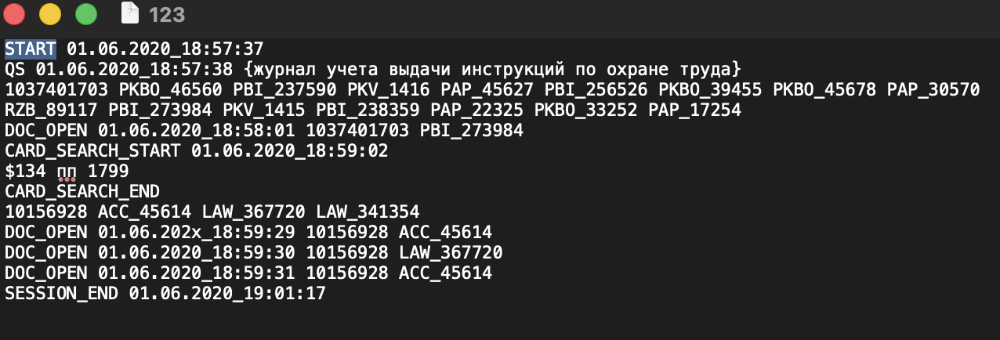

## Используемые версии зависимостей и плагинов

- Scala version: **2.12.18**  
- Spark version: **3.5.0**  
- Java compiler source/target: **11**

## Сборка и запуск

Для сборки проекта (JAR-файла с контейнером всех зависимостей) используется Maven:
```
mvn clean package
```

## В проекте используется слойная архитектура:

- Domain - содержит сущности, а также "знает" о том, как парсить события и сессию
- Infrastructure - слой отвечает за получение и преобразование данных в объекты domain, а также низкоуровневые функции
- Analysis - слой бизнес-логики, оперирует объектами domain для вычисления каждой task
- App - входная точка приложения, запускает обработку и связывает остальные слои, также отвечает за чтение файлов, вывод результатов и работу со Spark


## Объяснение строки с `unknown` в выводе файла

Строка с открытием документа DOC_OPEN имеет два формата:
- `DOC_OPEN` <dаtetime> <SEARCH_ID> <DOC_ID>
- `DOC_OPEN` <SEARCH_ID> <DOC_ID>

В выходных данных `result/opens.txt` для каждого открытия документа фиксируется дата в формате `dd.MM.yyyy`, извлекаемая из метки времени (timestamp). Поэтому в случаях, когда DOC_OPEN в строке не имеет <dаtetime>, дата становится `"unknown"`.

Если в конфигурации проекта установлено `dropUnknownDates = true`, то записи с `"unknown"` не сохраняются, если же опция выключена (по умолчанию), данные с `"unknown"` остаются, чтобы не терять событие вовсе.

## Логирование

Информация об ошибках и необработанных форматах собирается в `result/logs.txt`, туда же записываются данные при аварийной обработке сессии, когда получаем исключение - программа продолжает работу, не учитывая сессию, в логи попадают данные со stack trace

В логах предусмотрен аккумулятор ошибок и для каждого типа в файл выводится не больше заданного числа (10) записей

Добавим ошибку в один из файлов:


После запуска в `result/logs.txt` появилась строка с именем файла и ошибкой:
```
InvalidSession: 1
[WARINING] Not founds docs inside CARD_SEARCH: 31
----------
5547 | [WARINING] Not founds docs inside CARD_SEARCH: 382205392
5632 | [WARINING] Not founds docs inside CARD_SEARCH: -1613973812
123 | Exception (parseSession failed):
  Type: InvalidSession
  Message: First line must be started SESSION_START, found line: START 01.06.2020_18:57:37
  Stack trace:
      at org.example.domain.Session$.parse(Session.scala:38)
    at org.example.infrastructure.Parser$.parseSession(Parser.scala:34)
    at org.example.app.MainApp$.$anonfun$main$2(MainApp.scala:34)

1486 | [WARINING] Not founds docs inside CARD_SEARCH: 882460750
6209 | [WARINING] Not founds docs inside CARD_SEARCH: 23414234
6211 | [WARINING] Not founds docs inside CARD_SEARCH: 1843207469
184 | [WARINING] Not founds docs inside CARD_SEARCH: 18093775
2015 | [WARINING] Not founds docs inside CARD_SEARCH: 298608125
6710 | [WARINING] Not founds docs inside CARD_SEARCH: 184228265
6880 | [WARINING] Not founds docs inside CARD_SEARCH: 20199305
2537 | [WARINING] Not founds docs inside CARD_SEARCH: 42795921

```

## Пример работы программы
```
(debug) QS total: 17137
(debug) CARD_SEARCH total: 4345
(Task1) ACC_45616 CARD_SEARCH count: 24
(Task2) Each document from QS for each day -> result/opens.txt
Error logs -> result/logs.txt

Process finished with exit code 0
```

## Тесты

Для парсера из `infrastructure/Parser` написаны тесты, которые для файлов из `test/resources` построчно разбирают сессии и собирает объект domain, результаты записываются в `test/result`

Например для файла `test/resources/7247`:
```
SESSION_START 23.04.2020_21:20:23
CARD_SEARCH_START 23.04.2020_21:21:03
$134 инвентаризация тмц
CARD_SEARCH_END 
211758114 DOF_91786 DOF_100639 RZR_107970 DOF_100446 DOF_71360 DOF_100445 PBI_253397 DOF_71361 DOF_100435 PBI_270861 DOF_85886 PPN_49 DOF_71362 DOF_91794 PBI_199912 DOF_100451 DOF_87043 DOF_100457 DOF_91799 PKS_24 DOF_71359 DOF_100444 DOF_85869 DOF_91793 RZR_209425 RZR_27261 DOF_85885 DOF_91792 PBI_236817 PBI_259808 PKS_8 ACC_45614 DOF_85887 DOF_100618 DOF_100439 DOF_91782 DOF_85888 PPN_48 PBI_274177 DOF_91811 DOF_71350 DOF_71351 DOF_85870 DOF_85947 PBI_238262
DOC_OPEN  211758114 DOF_85886
DOC_OPEN  211758114 DOF_91792
DOC_OPEN  211758114 RZR_209425
DOC_OPEN  211758114 DOF_100457
DOC_OPEN  211758114 DOF_85870
DOC_OPEN  211758114 PBI_199912
CARD_SEARCH_START 23.04.2020_21:28:42
$134 ПБУ 10/99 п 172
$0 LAW_179199
CARD_SEARCH_END 
162106546 LAW_179199
DOC_OPEN  162106546 LAW_179199
SESSION_END 23.04.2020_21:32:19
```

получим файл `test/result/7247.txt`:
```
Session ID: 7247

Card Searches:
cardId: 211758114
timestamp: 23.04.2020_21:21:03
params: (134, 'инвентаризация тмц')
foundDocs: DOF_91786, DOF_100639, RZR_107970, DOF_100446, DOF_71360, DOF_100445, PBI_253397, DOF_71361, DOF_100435, PBI_270861, DOF_85886, PPN_49, DOF_71362, DOF_91794, PBI_199912, DOF_100451, DOF_87043, DOF_100457, DOF_91799, PKS_24, DOF_71359, DOF_100444, DOF_85869, DOF_91793, RZR_209425, RZR_27261, DOF_85885, DOF_91792, PBI_236817, PBI_259808, PKS_8, ACC_45614, DOF_85887, DOF_100618, DOF_100439, DOF_91782, DOF_85888, PPN_48, PBI_274177, DOF_91811, DOF_71350, DOF_71351, DOF_85870, DOF_85947, PBI_238262
---
cardId: 162106546
timestamp: 23.04.2020_21:28:42
params: (134, 'ПБУ 10/99 п 172'), (0, 'LAW_179199')
foundDocs: LAW_179199
---
==================================================
No Query Searches found.
==================================================
Doc Opens:
timestamp: unknown
cardOrQSId: 211758114
docId: DOF_85886
---
timestamp: unknown
cardOrQSId: 211758114
docId: DOF_91792
---
timestamp: unknown
cardOrQSId: 211758114
docId: RZR_209425
---
timestamp: unknown
cardOrQSId: 211758114
docId: DOF_100457
---
timestamp: unknown
cardOrQSId: 211758114
docId: DOF_85870
---
timestamp: unknown
cardOrQSId: 211758114
docId: PBI_199912
---
timestamp: unknown
cardOrQSId: 162106546
docId: LAW_179199
---
```
